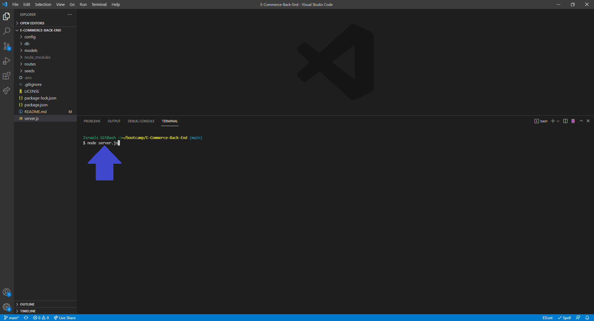
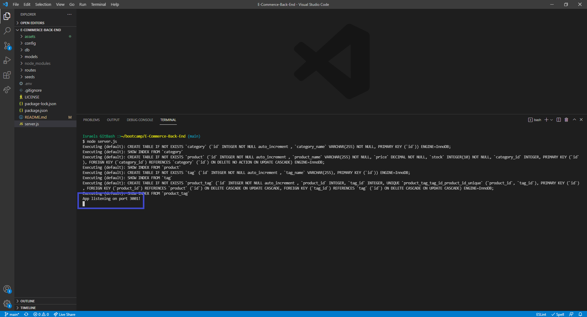
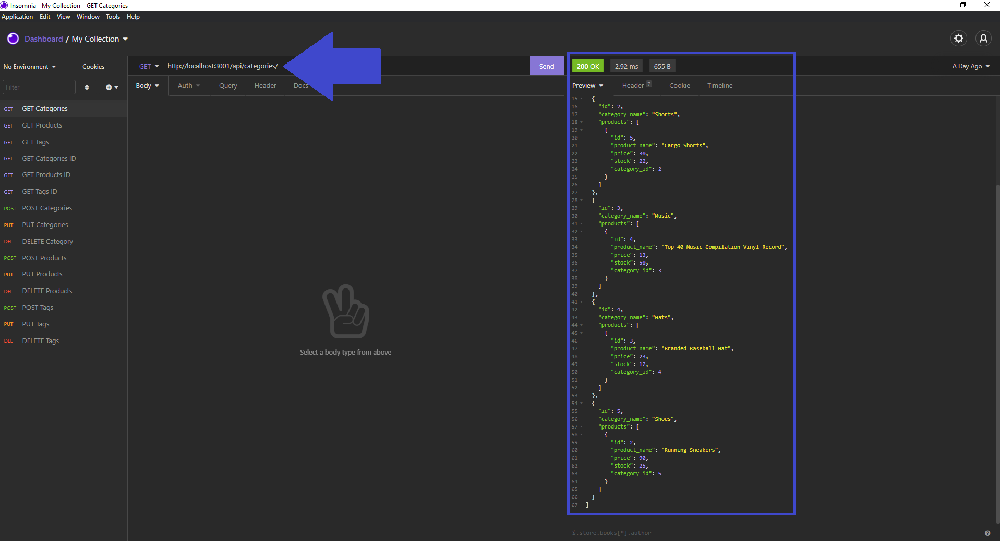
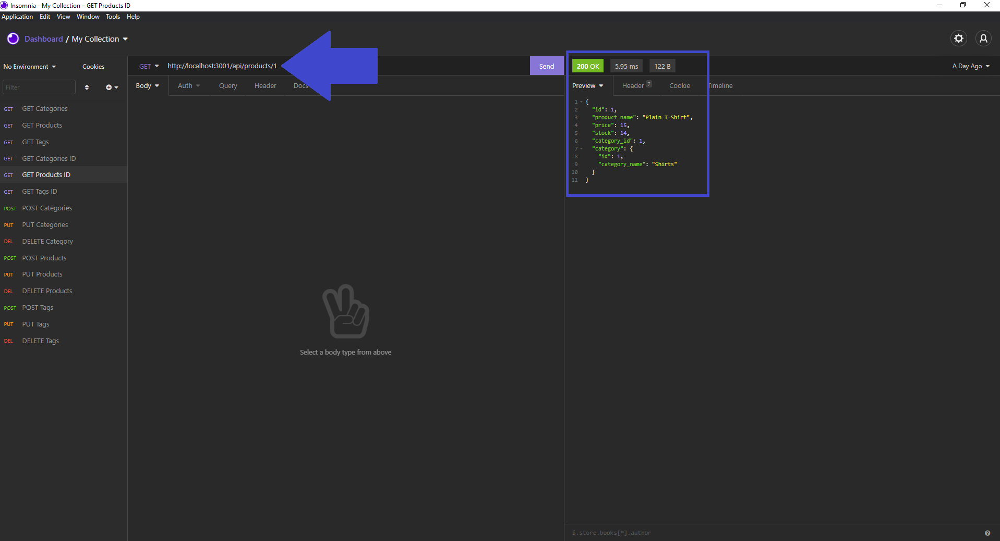
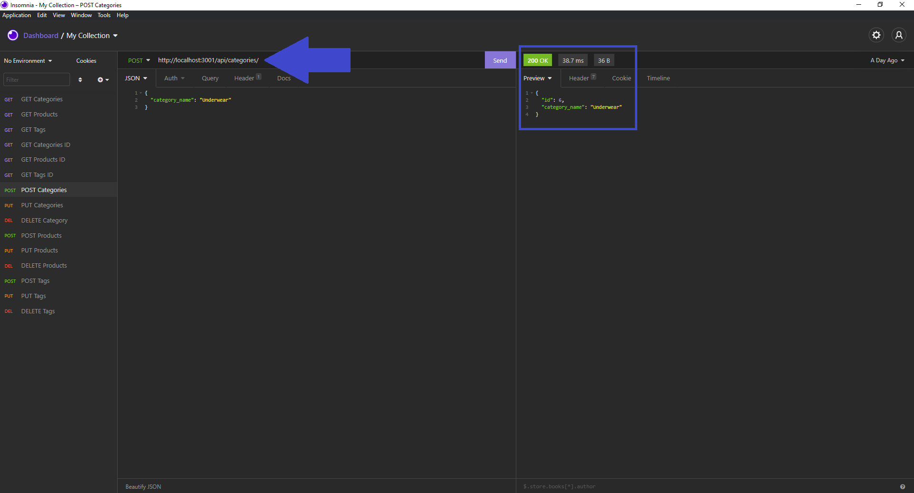
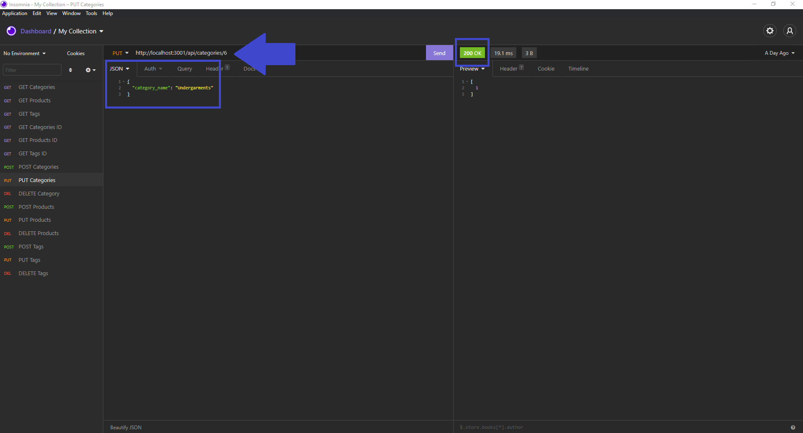
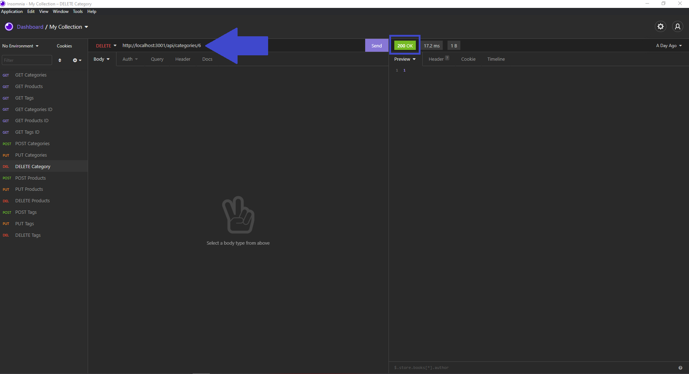

# E-Commerce-Back-End


## Description
This application uses Express.js and Sequelize to interact with a MySQL database. The application is started when the database is sourced from the schema and the seed files are run. The back end application can be tested by using insomnia. This application was created with the latest technologies to help internet company managers compete with other e-commerce companies.

This project has helped me practice using Models, Routes and Sequelize. It also has taught me how to use environment variables to store sensitive data like your MySQL username, password, and database name.

## Table of Contents
- [Installation](#installation)
- [Usage](#usage)
- [Contributing](#contributing)
- [Questions](#questions)
- [License](#license)

## Installation
How to install this application and getting started:

* Clone the repo to your local machine
* Open the integrated terminal on the server.js file
* Run `npm install --y` which will install any dependencies
* Open the integrated terminal on the [db](./db) folder
* Using MySQL shell commands enter `source schema.sql` which will create the database
* Return to the integrated terminal on the server.js file
* Run `npm run seed` which will seed the data

## Usage
You can view a Demo Video showing how to use this application by clicking on this link https://drive.google.com/file/d/1n-0qY1xkjB_5xN6XQKEzJwh9OKn7D7az/view?usp=sharing.

### Step 1
> **Note**: Not all available options and steps will be demonstrated here
* Invoke the following command on your integrated terminal:

```bash
node server.js
```


### Step 2
* After the command has been invoked in the terminal you will see an "App listening" message show up confirming the application has been initiated.



### Step 3
* The following images demonstrate a GET request for all Categories and one particular product by id




### Step 4
* The following images demonstrate a POST, PUT and DELETE requests for catagories
> **Note**: For the following request you can see the successfully status of 200 show on the top




> **Note**: Not all applications options are demonstrated or depicted here

## Contributing
There are many ways in which you can participate in this project, for example:

* Submit bugs and feature requests
* Review source code changes
* Review the documentation and make pull requests for anything from typos to additional and new content

## Questions
To find more information and the repository on this project please visit my [GitHub](https://github.com/israelmrios).

For any additional questions please email me [here](mailto:israelm.riosjr@gmail.com).

## License
Copyright (c) 2021 Israel M Rios.
Licensed under the [MIT License](LICENSE).